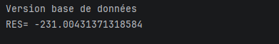
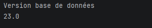
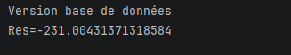
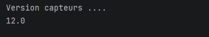
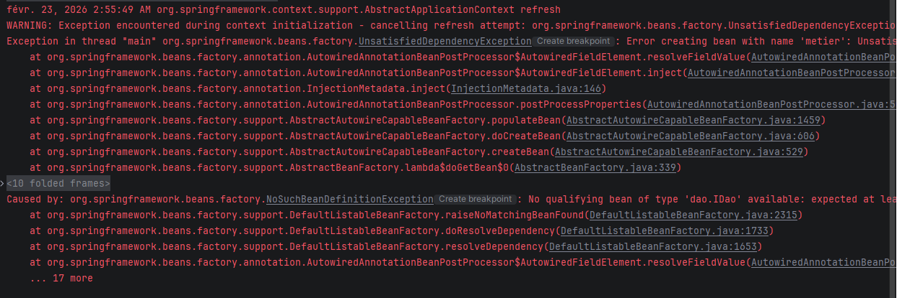

# Rapport de TP : Inversion de Contrôle et Injection de Dépendances
**Nom :** MAJRI SALMA
**Filière :** SDIA-1
**Encadrant :** Pr. Mohamed YOUSSFI

---

## 1. Introduction
Ce projet consiste à mettre en œuvre le concept d'**Inversion de Contrôle (IoC)** et d'**Injection de Dépendances (DI)**.
## 2. Objectifs du TP
- Séparer la logique d'accès aux données (DAO) de la logique métier.
- Pratiquer l'injection des dépendances par instanciation statique et dynamique.
- Maîtriser la configuration de Spring via XML et Annotations.
- Développer un **Mini-Framework IoC** (Partie 2).

## 3. Architecture du Projet
L'application est structurée autour de deux interfaces principales :
- `IDao` : Interface pour la récupération des données.
- `IMetier` : Interface pour les calculs métiers.

## Partie 1 : Création des Interfaces et Implémentations
- Mise en place de l'interface `IDao` et son implémentation `DaoImpl`.
- Mise en place de l'interface `IMetier` et son implémentation `MetierImpl`.
- Application du **couplage faible** : la classe métier communique avec la couche DAO via u## 4. Tests et Résultats

### 5.1. Faire l'injection des dépendances :
### a. Par instanciation statique
Tester l'injection statique en créant la classe `Pres1`:
##### **Résultat console :**

### b. Par instanciation dynamique
Cette méthode permet de rendre l'application fermée à la modification mais ouverte à l'extension. L'instanciation se fait via la **Réflexion Java** en lisant les noms des classes depuis un fichier `config.txt`.

##### **Résultat console :**

### 5.b. Test avec une deuxième implémentation (DaoImpl2)
Pour prouver la flexibilité de l'instanciation dynamique, j'ai créé une classe `DaoImpl2` dans le package `ext`.

##### **Résultat console :**

### 5.c. En utilisant le Framework Spring 
#### Version XML

Dans cette étape, nous avons délégué la gestion de l'instanciation et de l'injection des dépendances au conteneur IoC de Spring.

#### 1. Configuration des dépendances (pom.xml)
Nous avons ajouté les dépendances `spring-core` et `spring-context` pour pouvoir utiliser le framework.

#### 2. Fichier de configuration (config.xml)
Le fichier `config.xml` définit les beans et gère l'injection via la balise `<property>`

#### Version Annotations
Utilisation des annotations pour une configuration plus légère et moderne :
* **@Component** : Pour déclarer les Beans.
* **@Autowired** : Pour l'injection automatique.

---

## 3. Problématique d'Ambiguité (Gestion des Erreurs)

Lors de l'utilisation de la version Annotations, si deux classes implémentent la même interface (ex: `DaoImpl` et `DaoImplV2`) et sont marquées avec `@Component`, Spring génère l'erreur suivante :

### Solution
Pour résoudre ce conflit, nous avons utilisé :
2.  **@Qualifier("nomBean")** : Pour spécifier exactement quel Bean injecter.